# Progetto di Analisi delle Partite di Calcio

## Panoramica

Questo progetto implementa un sistema avanzato di analisi video per le partite di calcio. Utilizza tecniche di computer vision, machine learning e analisi dei dati per estrarre informazioni dettagliate sulle prestazioni dei giocatori, le tattiche di squadra e gli eventi chiave della partita.

## Struttura del Progetto

```
soccer_analysis/
├── src/
│   ├── preprocess/
│   ├── object_detection/
│   ├── analysis/
│   ├── data_aggregation/
│   ├── advanced_analysis/
│   ├── visualization/
│   ├── real_time_analysis/
│   ├── field_analysis/
│   ├── model_optimization/
│   ├── event_detection/
│   ├── team_strategy/
│   └── utils/
├── tests/
├── data/
├── models/
├── docs/
├── config/
├── output/
├── main.py
├── requirements.txt
└── README.md
```



```mermaid
graph TD
    classDef input fill:#a8e6cf,stroke:#333,stroke-width:2px;
    classDef process fill:#f0f0f0,stroke:#333,stroke-width:1px;
    classDef output fill:#ffd3b6,stroke:#333,stroke-width:2px;
    classDef subProcess fill:#e6e6fa,stroke:#333,stroke-width:1px;

    A[Input Video]:::input --> B[Preprocessing]:::process
    B --> B1[Video Decoding]
    B1 --> B2[Frame Extraction]
    B2 --> DE[Data Enhancement]:::process
    
    subgraph DataEnhancement[Data Enhancement]
        DE --> DE1[Noise Reduction]:::subProcess
        DE --> DE2[Color Correction]:::subProcess
        DE --> DE3[Frame Interpolation]:::subProcess
        DE --> DE4[Resolution Upscaling]:::subProcess
    end
    
    DE --> C[Object Detection & Tracking]:::process
    C --> |YOLO v5| D[Main Analysis Loop]:::process

    subgraph Analysis
        D --> E[Player Analysis]:::process
        E --> |CNN + SVM| E1[Team Assignment]
        E --> |Hungarian Algorithm| E2[Player Tracking]
        E2 --> |Kalman Filter| E2A[Position Prediction]
        E2 --> |Optical Flow| E2B[Motion Estimation]
        E --> E3[Performance Metrics]
        E3 --> |Euclidean Distance| E3A[Distance]
        E3 --> |Velocity Thresholding| E3B[Sprints]
        E3 --> |Kernel Density Estimation| E3C[Heat Maps]

        D --> F[Ball Tracking]:::process
        F --> |Hough Transform| F1[Ball Detection]
        F --> |Extended Kalman Filter| F2[Trajectory Prediction]

        D --> G[Event Detection]:::process
        G --> |Graph-based Pass Detection| G1[Passes]
        G1 --> |LSTM| G1A[Pass Quality Prediction]
        G --> |Convolutional LSTM| G2[Shots]
        G --> |Corner Region Activation| G3[Corners]
        G --> |Rule-based + Random Forest| G4[Fouls]

        D --> H[Team Strategy Analysis]:::process
        H --> |Delaunay Triangulation| H1[Formations]
        H --> |Pressure Index Calculation| H2[Pressing]
        H --> |Voronoi Diagrams| H3[Space Control]
        H --> |Time-series Analysis| H4[Ball Possession]
    end

    Analysis --> I[Data Aggregation]:::process
    I --> |Exponential Moving Average| I1[Possession]
    I --> |K-means Clustering| I2[Movement Patterns]
    I --> |Network Analysis| I3[Passing]
    I --> |Shot Maps| I4[Shooting]

    I --> J[Advanced Analysis]:::process
    J --> |Logistic Regression| J1[Expected Goals xG]
    J --> |Spectral Clustering| J2[Pass Networks]
    J --> |Seq2Seq LSTM| J3[Tactical Patterns]
    J --> |Gradient Boosting| J4[Player Role Classification]

    J --> K[Visualization]:::process
    K --> |OpenCV| L[Analyzed Video]:::output
    K --> |Matplotlib + WebGL| M[Virtual Field Visualization]:::output
    I --> |Pandas + Seaborn| N[Statistics Report]:::output
    I --> |Radar Charts| O[Performance Metrics]:::output

    D --> P[Real-time Analysis]:::process
    P --> |Sliding Window Algorithm| Q[Live Stats Updates]:::output
    P --> |Decision Trees| R[Tactical Suggestions]:::output

    subgraph FieldAnalysis
        S[Field Analysis]:::process
        S --> |Homography Transform| S1[Virtual Field Creation]
        S --> |Quadtree Partitioning| S2[Field Zones]
        S --> |Heatmaps + Contour Analysis| S3[Zone Activity]
    end

    C --> S
    S --> I

    subgraph ModelOptimization[Model Optimization]
        MO1[Transfer Learning]:::subProcess
        MO2[Hyperparameter Tuning]:::subProcess
        MO3[Ensemble Methods]:::subProcess
    end

    C --> ModelOptimization
    ModelOptimization --> D
```

## Flusso di Lavoro

1. **Input Video**: Il processo inizia con un video di una partita di calcio.

2. **Preprocessing**:
   - `video_decoder.py`: Decodifica il video in input.
   - `frame_extractor.py`: Estrae i singoli frame dal video.
   - Data Enhancement:
     - `noise_reduction.py`: Riduce il rumore nei frame.
     - `color_correction.py`: Corregge i colori per una migliore analisi.
     - `frame_interpolation.py`: Interpola i frame per un'analisi più fluida.
     - `resolution_upscaling.py`: Aumenta la risoluzione dei frame se necessario.

3. **Object Detection & Tracking**:
   - `yolo_v5_detector.py`: Utilizza YOLO v5 per rilevare giocatori, palla e altri oggetti.
   - `player_classifier.py`: Classifica i giocatori per squadra.
   - `ball_detector.py`: Rileva specificamente la palla.
   - `object_tracker.py`: Traccia gli oggetti rilevati tra i frame.

4. **Main Analysis Loop**:
   - Player Analysis:
     - `team_assignment.py`: Assegna i giocatori alle squadre (CNN + SVM).
     - `player_tracking.py`: Traccia i movimenti dei giocatori (Algoritmo Ungherese).
     - `kalman_filter.py`: Predice le posizioni future dei giocatori.
     - `optical_flow.py`: Stima il movimento dei giocatori.
     - `performance_metrics.py`: Calcola metriche di prestazione (distanza, sprint, mappe di calore).
   - Ball Tracking:
     - `hough_transform.py`: Rileva la palla usando la trasformata di Hough.
     - `extended_kalman_filter.py`: Predice la traiettoria della palla.
   - Event Detection:
     - `graph_based_pass_detection.py`: Rileva i passaggi.
     - `convolutional_lstm.py`: Rileva i tiri.
     - `corner_detection.py`: Rileva i calci d'angolo.
   - Team Strategy Analysis:
     - `delaunay_triangulation.py`: Analizza le formazioni delle squadre.
     - `pressure_index.py`: Calcola l'indice di pressione.
     - `voronoi_diagrams.py`: Analizza il controllo dello spazio.
     - `time_series_analysis.py`: Analizza il possesso palla nel tempo.

5. **Data Aggregation**:
   - `possession_analysis.py`: Analizza il possesso palla (Media Mobile Esponenziale).
   - `movement_analysis.py`: Analizza i modelli di movimento (K-means Clustering).
   - `passing_analysis.py`: Analizza le reti di passaggio.
   - `shooting_analysis.py`: Analizza i tiri e crea mappe dei tiri.

6. **Advanced Analysis**:
   - `expected_goals.py`: Calcola l'Expected Goals (xG) usando regressione logistica.
   - `pass_networks.py`: Crea reti di passaggio usando clustering spettrale.
   - `tactical_patterns.py`: Riconosce schemi tattici (Seq2Seq LSTM).
   - `player_role_classification.py`: Classifica i ruoli dei giocatori (Gradient Boosting).

7. **Visualization**:
   - `video_renderer.py`: Renderizza il video analizzato (OpenCV).
   - `field_visualizer.py`: Crea una visualizzazione 2D del campo (Matplotlib + WebGL).
   - `stats_generator.py`: Genera report statistici (Pandas + Seaborn).
   - `heatmap_generator.py`: Genera mappe di calore e grafici radar.

8. **Real-time Analysis**:
   - `live_stats_updater.py`: Aggiorna le statistiche in tempo reale (Algoritmo a Finestra Scorrevole).
   - `tactical_suggestions.py`: Fornisce suggerimenti tattici in tempo reale (Alberi Decisionali).

9. **Field Analysis**:
   - `virtual_field_creator.py`: Crea un campo virtuale (Trasformazione Omografica).
   - `field_zone_analyzer.py`: Analizza l'attività per zone del campo (Partizionamento Quadtree).

10. **Model Optimization**:
    - `transfer_learning.py`: Applica il transfer learning per migliorare i modelli.
    - `hyperparameter_tuning.py`: Ottimizza gli iperparametri dei modelli.
    - `ensemble_methods.py`: Implementa metodi ensemble per migliorare le prestazioni.

## Output

- Video Analizzato: Video originale con sovrapposizioni analitiche.
- Visualizzazione Campo Virtuale: Rappresentazione 2D del campo con posizioni di giocatori e palla.
- Report Statistico: Report dettagliato con tutte le statistiche calcolate.
- Metriche di Prestazione: Metriche specifiche sulle prestazioni dei singoli giocatori.
- Aggiornamenti Statistiche in Tempo Reale: Statistiche aggiornate durante la partita.
- Suggerimenti Tattici: Suggerimenti generati durante la partita basati sull'analisi in corso.

## Utilizzo

1. Installare le dipendenze: `pip install -r requirements.txt`
2. Configurare i parametri nel file `config/config.yaml`
3. Eseguire l'analisi: `python main.py --input path/to/video.mp4`
